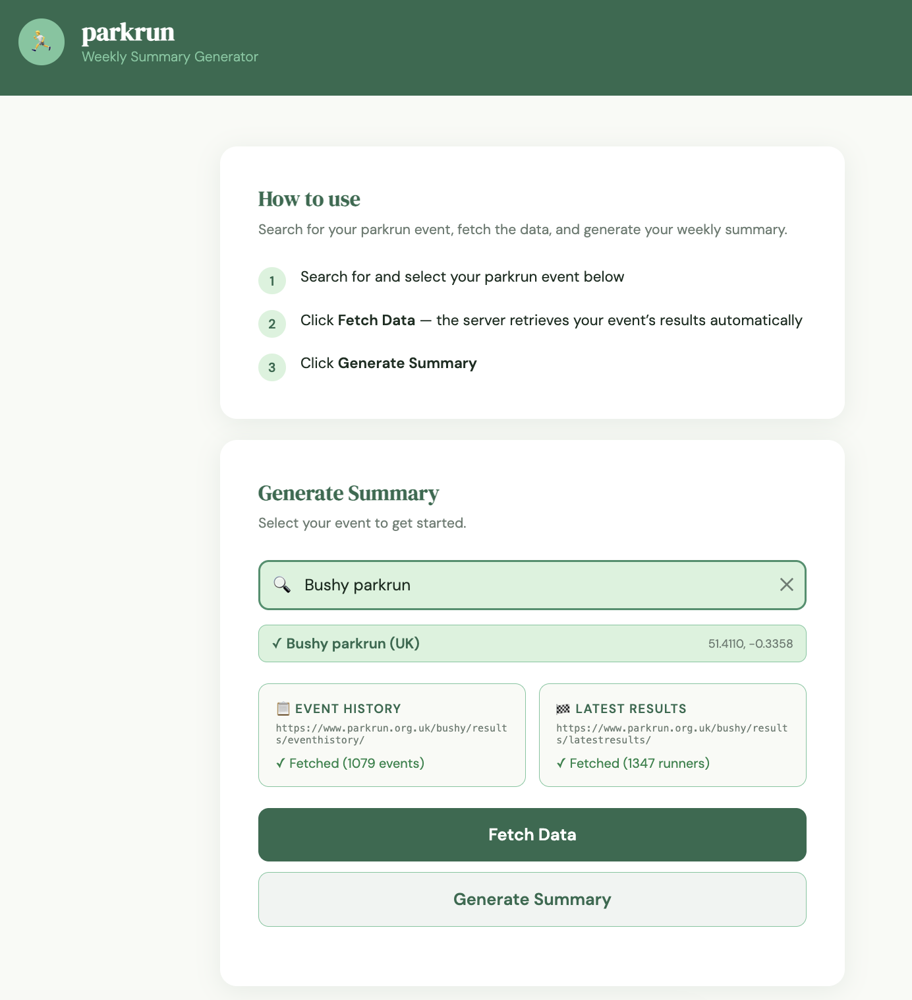

# parkrun Summary Generator

A self-hosted web application that automatically fetches parkrun event data and generates a richly formatted weekly HTML summary — no manual file downloads required.

Built for parkrun volunteers and run directors who want a polished, shareable event summary each Saturday.

  

---

## Features

- 🔍 **Search any parkrun event** from the full global events list
- 🤖 **Automatic data fetching** — no manual HTML downloads; the server fetches parkrun pages directly using cloudscraper
- 📁 **Manual upload fallback** — if automatic fetching is blocked, save the pages in your browser and upload them directly
- 📊 **Comprehensive summary** including:
  - Weather at race time (via Open-Meteo, no API key needed)
  - Attendance and volunteer stats with historical averages
  - Top 10 male and female finishers
  - Personal bests, milestone achievers (25/50/100/250/500 runs), milestone chasers
  - First timers (first ever parkrun + first time at this event)
  - Age category winners
  - Club representation with full runner lists
  - Fun stats: noughty step, multiples of 50, rep-digit positions
  - All-time records and course records
- 📈 **Persistent report counter** — tracks total summaries generated across rebuilds
- 🌍 **Works for any parkrun globally**
- 🐳 **Docker-ready** — designed for self-hosted deployment (Synology NAS or any Docker host)

---

## Screenshots



---

## Requirements

- Docker and Docker Compose
- Outbound internet access from the host (to fetch parkrun pages and weather data)

---

## Installation

### 1. Clone the repository

```bash
git clone https://github.com/catfordfire/parkrun-summary-generator.git
cd parkrun-summary-generator
```

### 2. (Optional) Create a local summaries directory

```bash
mkdir -p /your/path/to/summaries
```

Update the volume path in `docker-compose.yml` to match.

### 3. Build and run

```bash
docker compose up -d --build
```

### 4. Access the app

Open `http://localhost:8767` in your browser.

---

## Usage

1. **Search** for your parkrun event in the search box
2. **Click Fetch Data** — the server retrieves the event history and latest results pages automatically. If parkrun blocks the request, save the pages manually in your browser and use the upload buttons instead
3. **Click Generate Summary** — this takes 20–60 seconds
4. **Click View in Browser** to open the finished HTML summary

> If the summary looks incomplete on first click, return to the page and click View in Browser again.

---

## Configuration

### docker-compose.yml

```yaml
volumes:
  - /your/path/summaries:/data/summaries
```

Change the left side to wherever you want summaries saved on the host.

### Ports

Default port is `8767`. Change in both `docker-compose.yml` and `Dockerfile` if needed.

---

## Architecture

| Component | Details |
|-----------|---------|
| Backend | Python 3.12 + Flask |
| Web server | Gunicorn (4 workers) |
| Scraping | cloudscraper (Cloudflare bypass) |
| Parsing | BeautifulSoup4 |
| Weather | Open-Meteo archive/forecast API |
| Frontend | Vanilla JS, no build step |
| Deployment | Docker + Docker Compose |

---

## Project Structure

```
parkrun-summary-generator/
├── app.py                 # Flask application, routes, frontend HTML
├── parkrun_summary.py     # Data parsing and HTML report generation
├── Dockerfile
├── docker-compose.yml
└── .dockerignore
```

---

## Notes

- This project is not affiliated with or endorsed by parkrun
- Data is fetched from public parkrun results pages
- Weather data is provided by [Open-Meteo](https://open-meteo.com/) (free, no API key required)

---

## Changelog

### v1.3
- Manual file upload fallback — if parkrun blocks automatic fetching, save the HTML pages in your browser and upload them directly
- Club Runners section added — all affiliated runners listed by club with member count badges
- Fixed import error (`shrewsbury_summary` → `parkrun_summary`)

### v1.2
- Persistent report counter — tracks total summaries generated across rebuilds, displayed in the footer
- Search placeholder updated to "e.g. Bushy"

### v1.1
- Weather icons now reflect actual conditions (☀️ clear, ⛅ partly cloudy, 🌦️ rain, ❄️ snow, ⛈️ thunder etc.)
- Rain field now shows ✅ Dry or 🌧️ with the actual amount
- "First time at this event" now fully generic for any parkrun location
- `parkrun_summary.py` — fully generic, works for any parkrun event worldwide
- Favicon added — parkrun-inspired green icon with running figure and "p" lettermark

### v1.0
- Initial release
- Search any global parkrun event
- Automatic server-side data fetching via cloudscraper
- Full weekly summary: attendance, volunteers, top 10, PBs, milestones, age categories, clubs, records
- Weather via Open-Meteo (no API key required)
- Docker-ready for self-hosted deployment

---

## Contributing

Pull requests welcome. Please open an issue first for significant changes.

## Licence

MIT
